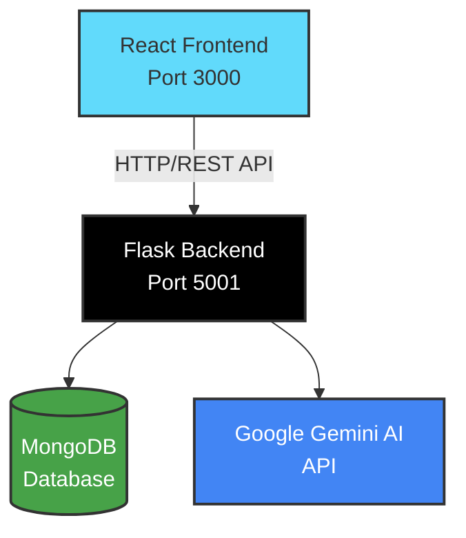

<div align="center">

# 🎓 MetroEval

### **AI-Powered Feedback & Peer Review System**

**Built for Metropolia University of Applied Sciences**

[](https://www.python.org/)
[](https://reactjs.org/)
[](https://flask.palletsprojects.com/)
[](https://www.mongodb.com/)
[](https://gemini.google.com/)

[Features](#-features) • [Quick Start](#-quick-start) • [Documentation](#-documentation) • [API Reference](#-api-documentation)

---

</div>

## 📖 About

**MetroEval** is a production-grade, full-stack educational platform that revolutionizes the feedback and peer review process. Leveraging **Google Gemini AI**, it provides instant, comprehensive feedback on student submissions while facilitating intelligent peer matching and performance analytics.

### ✨ What Makes MetroEval Special?

<div align="center">

| 🚀 **Instant AI Feedback** | 👥 **Smart Peer Matching** | 📊 **Advanced Analytics** |
|:---:|:---:|:---:|
| Get detailed feedback in seconds | Intelligent algorithm-based pairing | Track progress with insights |
| Multi-dimensional analysis | Department & skill-based matching | Identify at-risk students |

</div>

---

## 🎯 Key Features

### 🎓 For Students

<table>
<tr>
<td width="50%">

#### 📝 **Submission Management**
- ✅ Multi-file upload support
- ✅ Version history tracking
- ✅ Practice mode submissions
- ✅ Code, essays, and reports

</td>
<td width="50%">

#### 🤖 **AI-Powered Feedback**
- ⚡ Instant feedback generation
- 📊 Multi-dimensional scoring
- 🎯 Detailed improvement suggestions
- 📋 Submission-type-specific templates

</td>
</tr>
<tr>
<td width="50%">

#### 👥 **Peer Reviews**
- 🔄 Receive & provide feedback
- 📋 Structured feedback forms
- 💬 Feedback reactions & discussions
- ⚖️ Fair workload distribution

</td>
<td width="50%">

#### 📚 **Learning Tools**
- 🃏 AI-generated flashcards
- 💬 Interactive tutor chat
- 📖 Learning resources
- 📄 Submission templates

</td>
</tr>
</table>

### 👨‍🏫 For Teachers

<table>
<tr>
<td width="50%">

#### 📊 **Dashboard & Analytics**
- 📈 Student performance overview
- ⚠️ At-risk student identification
- 🎯 Department-wide analytics
- 🔮 Performance prediction models

</td>
<td width="50%">

#### 📋 **Management Tools**
- 👥 Student management
- 📝 Submission review & grading
- 🔍 Peer review oversight
- 📢 Announcements & deadlines

</td>
</tr>
</table>

---

## 🏗️ Architecture

### Tech Stack

<div align="center">

#### **Backend** 🐍

| Component | Technology | Version |
|:---------:|:----------:|:-------:|
| **Framework** | Flask | 3.0.0 |
| **Database** | MongoDB (MongoEngine) | 0.27.0 |
| **AI Service** | Google Gemini | 2.0 Flash |
| **ML/Analytics** | scikit-learn, numpy, pandas | Latest |
| **Security** | Flask-Login, Flask-Limiter | Latest |
| **Testing** | pytest, pytest-cov | Latest |

#### **Frontend** ⚛️

| Component | Technology | Version |
|:---------:|:----------:|:-------:|
| **Framework** | React | 18.2.0 |
| **Build Tool** | Vite | 5.0.8 |
| **Routing** | React Router DOM | 6.20.0 |
| **HTTP Client** | Axios | 1.6.2 |
| **Charts** | Chart.js | 4.4.0 |
| **Testing** | Vitest, RTL | Latest |

</div>

### System Architecture



**Text Representation:**

```
┌─────────────────────────────────┐
│   React Frontend (Port 3000)   │
│   ⚛️ Vite + React + Router      │
└──────────────┬──────────────────┘
               │ HTTP/REST API
               │ (withCredentials)
┌──────────────▼──────────────────┐
│   Flask Backend (Port 5001)     │
│   🐍 Python + Flask + MongoEngine│
└──────┬──────────────────┬───────┘
       │                  │
┌──────▼──────┐  ┌────────▼────────┐
│   MongoDB   │  │  Gemini AI API │
│   🍃 NoSQL  │  │  🤖 AI Service  │
└─────────────┘  └─────────────────┘
```

---

## 🚀 Quick Start

### Prerequisites

Make sure you have the following installed:

- 🐍 **Python** 3.8+ (3.10+ recommended)
- 📦 **Node.js** 16+ (18+ recommended)
- 🍃 **MongoDB** 4.4+ (local or remote)
- 🔑 **Google Gemini API Key** ([Get one here](https://makersuite.google.com/app/apikey))

### Installation

#### 1️⃣ Clone the Repository

```bash
git clone <repository-url>
cd MetroEval
```

#### 2️⃣ Backend Setup

```bash
cd backend

# Create virtual environment
python3 -m venv venv
source venv/bin/activate  # Windows: venv\Scripts\activate

# Install dependencies
pip install -r requirements.txt
```

#### 3️⃣ Frontend Setup

```bash
cd frontend
npm install
```

#### 4️⃣ Environment Configuration

**Backend `.env` file** (`backend/.env`):

```env
# Security
SECRET_KEY=your-super-secret-key-change-in-production

# Database
MONGODB_URI=mongodb://localhost:27017/afprs
# Alternative:
# MONGODB_HOST=localhost
# MONGODB_PORT=27017
# MONGODB_DB=afprs

# AI Configuration
GEMINI_API_KEY=your-gemini-api-key-here

# Server
FLASK_ENV=development
PORT=5001
```

**Frontend `.env` file** (`frontend/.env`) - *Optional*:

```env
VITE_API_URL=http://localhost:5001/api
```

### 🏃 Running the Application

#### Development Mode

**Terminal 1 - Backend:**
```bash
cd backend
source venv/bin/activate
PYTHONPATH=. python3 app/main.py
```
🌐 Backend: `http://localhost:5001`

**Terminal 2 - Frontend:**
```bash
cd frontend
npm run dev
```
🌐 Frontend: `http://localhost:3000`

#### Production Deployment

**Backend:**
```bash
cd backend
gunicorn -w 4 -b 0.0.0.0:5001 app.wsgi:app
```

**Frontend:**
```bash
cd frontend
npm run build
# Serve dist/ with nginx, Apache, or your preferred server
```

---

## 🧪 Testing

### Backend Tests

```bash
cd backend
pytest
# With coverage report
pytest --cov=app --cov-report=html
```

### Frontend Tests

```bash
cd frontend
npm test
# Interactive UI
npm run test:ui
# Coverage report
npm run test:coverage
```

### Run All Tests

```bash
./scripts/run-tests.sh
```

---

## 📁 Project Structure

```
MetroEval/
│
├── 📂 backend/
│   ├── 📂 app/
│   │   ├── __init__.py          # Application factory
│   │   ├── main.py              # Entry point
│   │   ├── config.py            # Configuration
│   │   ├── wsgi.py              # Production WSGI
│   │   │
│   │   ├── 📂 api/
│   │   │   ├── 📂 v1/           # API v1 endpoints
│   │   │   │   ├── auth.py
│   │   │   │   ├── submissions.py
│   │   │   │   ├── feedback.py
│   │   │   │   ├── peer_reviews.py
│   │   │   │   ├── flashcards.py
│   │   │   │   ├── tutor.py
│   │   │   │   └── teacher.py
│   │   │   └── static.py
│   │   │
│   │   ├── 📂 core/
│   │   │   └── database.py      # MongoDB setup
│   │   │
│   │   ├── 📂 models/           # MongoEngine models
│   │   │   ├── user.py
│   │   │   ├── submission.py
│   │   │   ├── feedback.py
│   │   │   └── ...
│   │   │
│   │   ├── 📂 services/         # Business logic
│   │   │   ├── ai_service.py
│   │   │   ├── peer_matching_service.py
│   │   │   └── performance_predictor_service.py
│   │   │
│   │   ├── 📂 middleware/       # Flask middleware
│   │   │   ├── auth_middleware.py
│   │   │   ├── cors_middleware.py
│   │   │   ├── error_handler.py
│   │   │   └── security_middleware.py
│   │   │
│   │   ├── 📂 utils/            # Utilities
│   │   └── 📂 exceptions/      # Custom exceptions
│   │
│   ├── requirements.txt
│   └── pytest.ini
│
├── 📂 frontend/
│   ├── 📂 src/
│   │   ├── App.jsx              # Main component
│   │   ├── main.jsx             # React entry
│   │   │
│   │   ├── 📂 components/       # Shared components
│   │   ├── 📂 features/         # Feature modules
│   │   │   ├── auth/
│   │   │   ├── dashboard/
│   │   │   ├── submissions/
│   │   │   ├── learning/
│   │   │   └── profile/
│   │   │
│   │   ├── 📂 context/          # React Context
│   │   ├── 📂 services/         # API services
│   │   ├── 📂 hooks/            # Custom hooks
│   │   └── 📂 styles/           # CSS files
│   │
│   ├── package.json
│   └── vite.config.js
│
├── 📂 tests/
│   ├── 📂 backend/
│   └── 📂 frontend/
│
└── 📂 scripts/
    └── run-tests.sh
```

---

## 🔌 API Documentation

### Base URLs

| Environment | URL |
|:-----------:|:---:|
| **Development** | `http://localhost:5001/api/v1` |
| **Production** | `https://your-domain.com/api/v1` |

### Authentication

All protected endpoints require authentication via **Flask-Login session cookies**. The frontend automatically handles this with `withCredentials: true`.

### Key Endpoints

<details>
<summary><b>🔐 Authentication Endpoints</b></summary>

| Method | Endpoint | Description |
|:------:|:--------:|:-----------|
| `POST` | `/api/v1/auth/register` | Register new user |
| `POST` | `/api/v1/auth/login` | User login |
| `POST` | `/api/v1/auth/logout` | User logout |
| `GET` | `/api/v1/auth/me` | Get current user |

</details>

<details>
<summary><b>📝 Submission Endpoints</b></summary>

| Method | Endpoint | Description |
|:------:|:--------:|:-----------|
| `POST` | `/api/v1/submit` | Submit assignment |
| `GET` | `/api/v1/submissions` | List submissions |
| `GET` | `/api/v1/submissions/<id>` | Get submission details |
| `PUT` | `/api/v1/submissions/<id>` | Update submission |

</details>

<details>
<summary><b>💬 Feedback Endpoints</b></summary>

| Method | Endpoint | Description |
|:------:|:--------:|:-----------|
| `GET` | `/api/v1/feedback/<submission_id>` | Get feedback |
| `POST` | `/api/v1/feedback` | Create feedback |
| `PUT` | `/api/v1/feedback/<id>` | Update feedback |

</details>

<details>
<summary><b>👥 Peer Review Endpoints</b></summary>

| Method | Endpoint | Description |
|:------:|:--------:|:-----------|
| `GET` | `/api/v1/peer-reviews` | List peer reviews |
| `POST` | `/api/v1/peer-reviews` | Create peer review |
| `PUT` | `/api/v1/peer-reviews/<id>` | Complete review |

</details>

<details>
<summary><b>📚 Learning Tools Endpoints</b></summary>

| Method | Endpoint | Description |
|:------:|:--------:|:-----------|
| `POST` | `/api/v1/flashcards/generate` | Generate flashcards |
| `POST` | `/api/v1/tutor/chat` | Chat with AI tutor |

</details>

<details>
<summary><b>👨‍🏫 Teacher Endpoints</b></summary>

| Method | Endpoint | Description |
|:------:|:--------:|:-----------|
| `GET` | `/api/v1/teacher/students` | List all students |
| `GET` | `/api/v1/teacher/analytics` | Get analytics |
| `GET` | `/api/v1/teacher/predictions` | Performance predictions |

</details>

### Response Format

**Success Response:**
```json
{
  "success": true,
  "data": {
    // Response data
  },
  "message": "Optional success message"
}
```

**Error Response:**
```json
{
  "success": false,
  "error": "Error message",
  "code": "ERROR_CODE"
}
```

---

## 🔐 Security Features

<div align="center">

| 🔒 **Authentication** | 🛡️ **API Security** | 🔐 **Data Protection** | ✅ **Academic Integrity** |
|:---------------------:|:-------------------:|:---------------------:|:------------------------:|
| Flask-Login sessions | Rate limiting | Secure cookies | Plagiarism detection |
| Role-based access | CORS protection | File upload limits | Semantic analysis |
| Password hashing | Security headers | Input sanitization | Version tracking |

</div>

---

## 🎓 Department Support

MetroEval supports **6 departments** across Metropolia:

<div align="center">

| 🎓 General Studies | ⚙️ Engineering & CS | 💼 Business & Economics |
|:-----------------:|:------------------:|:---------------------:|
| 🎨 Design & Creative Arts | 🏥 Health & Life Sciences | 📚 Social Sciences & Humanities |

</div>

Each department features:
- ✅ Custom courses
- ✅ Department-specific analytics
- ✅ Filtered peer review matching
- ✅ Resource organization

---

## 🤖 AI Integration

### Google Gemini AI

MetroEval leverages **Google Gemini 2.0 Flash** for:

<div align="center">

| 🎯 **Feedback Generation** | 🃏 **Flashcard Creation** | 💬 **Tutor Chat** |
|:-------------------------:|:----------------------:|:----------------:|
| Multi-dimensional analysis | Topic-based generation | Interactive Q&A |
| Code & essay templates | Adaptive difficulty | Context-aware responses |
| Detailed suggestions | Coding & conceptual | Code explanations |

</div>

### Configuration

Set `GEMINI_API_KEY` in your backend `.env` file. The system gracefully degrades if the API key is not configured.

---

## 📊 Performance & Scalability

### Backend Optimizations

- 🗄️ **Database Indexing**: MongoDB indexes on frequently queried fields
- ⚡ **Query Optimization**: Efficient MongoEngine queries with limits
- 💾 **Caching**: Session-based caching for user data
- 🔗 **Connection Pooling**: MongoDB connection management

### Frontend Optimizations

- 📦 **Code Splitting**: Vite automatic code splitting
- 🚀 **Lazy Loading**: Route-based lazy loading
- 🎨 **Asset Optimization**: Vite build optimizations
- 🔄 **API Caching**: Axios response caching

### Scalability

- ↔️ **Horizontal Scaling**: Stateless backend design
- 🗄️ **Database Sharding**: MongoDB sharding support
- 🌐 **CDN Integration**: Static asset delivery
- ⚖️ **Load Balancing**: Gunicorn multi-worker support

---

## 🐛 Troubleshooting

<details>
<summary><b>❌ MongoDB Connection Failed</b></summary>

**Solutions:**
- Verify MongoDB is running: `mongod --version`
- Check `MONGODB_URI` in `.env`
- Ensure MongoDB is accessible on configured host/port
- Check firewall settings

</details>

<details>
<summary><b>🤖 Gemini API Errors</b></summary>

**Solutions:**
- Verify `GEMINI_API_KEY` is set correctly
- Check API quota limits
- Review error logs in backend console
- Ensure API key has proper permissions

</details>

<details>
<summary><b>🌐 CORS Issues</b></summary>

**Solutions:**
- Ensure frontend URL is in CORS allowed origins
- Check `withCredentials` is set in Axios config
- Verify backend CORS middleware configuration

</details>

<details>
<summary><b>🍪 Session Not Persisting</b></summary>

**Solutions:**
- Verify cookies are enabled in browser
- Check `SECRET_KEY` is set consistently
- Ensure same-site cookie settings
- Check browser privacy settings

</details>

---

## 📝 Development Guidelines

### Code Style

- **Python**: Follow PEP 8, use type hints where appropriate
- **JavaScript**: Follow ESLint configuration, use modern ES6+
- **React**: Functional components with hooks, feature-based organization

### Git Workflow

1. 🌿 Create feature branch from `main`
2. ✏️ Make changes with descriptive commits
3. ✅ Run tests before committing
4. 🔄 Submit pull request with description

### Testing Requirements

- ✅ New features must include tests
- 📊 Maintain >80% code coverage
- 🧪 Test both success and error paths

---

## ⚙️ Configuration

### Backend Configuration

Key settings in `backend/app/config.py`:

| Setting | Default | Description |
|:-------:|:-------:|:-----------|
| **Departments** | 6 | Predefined departments |
| **File Upload** | 5MB | Max file size |
| **Peer Review** | 2 | Peers per submission (1-5) |
| **Page Size** | 20 | Default API pagination (max 100) |
| **Flashcards** | 25 | Default count (max 100) |
| **Quiz Time** | 20 min | Default quiz duration |

### Security Settings

- 🔒 **Session Security**: HTTP-only cookies, SameSite=Lax, 24-hour lifetime
- ⏱️ **Rate Limiting**: Configured via Flask-Limiter
- 🌐 **CORS**: Configured for frontend origin
- 🛡️ **Security Headers**: Flask-Talisman protection

---

## 📄 License

[Specify your license here]

---

## 👥 Contributors

[Add contributors here]

---

## 🙏 Acknowledgments

<div align="center">

| 🎓 Metropolia University | 🤖 Google Gemini AI | 🐍 Flask & React Communities |
|:----------------------:|:------------------:|:---------------------------:|
| For the vision | For AI capabilities | For amazing frameworks |

</div>

---

## 📞 Support

<div align="center">

**Need help?** We're here for you!

- 🐛 [Open an issue](https://github.com/your-repo/issues) on GitHub
- 📧 Contact the development team
- 📚 Review the documentation

</div>

---

<div align="center">

### **Built with ❤️ for Metropolia University of Applied Sciences**

**Made with** ⚛️ React • 🐍 Flask • 🤖 Gemini AI • 🍃 MongoDB

[⬆ Back to Top](#-metroeval)

</div>
