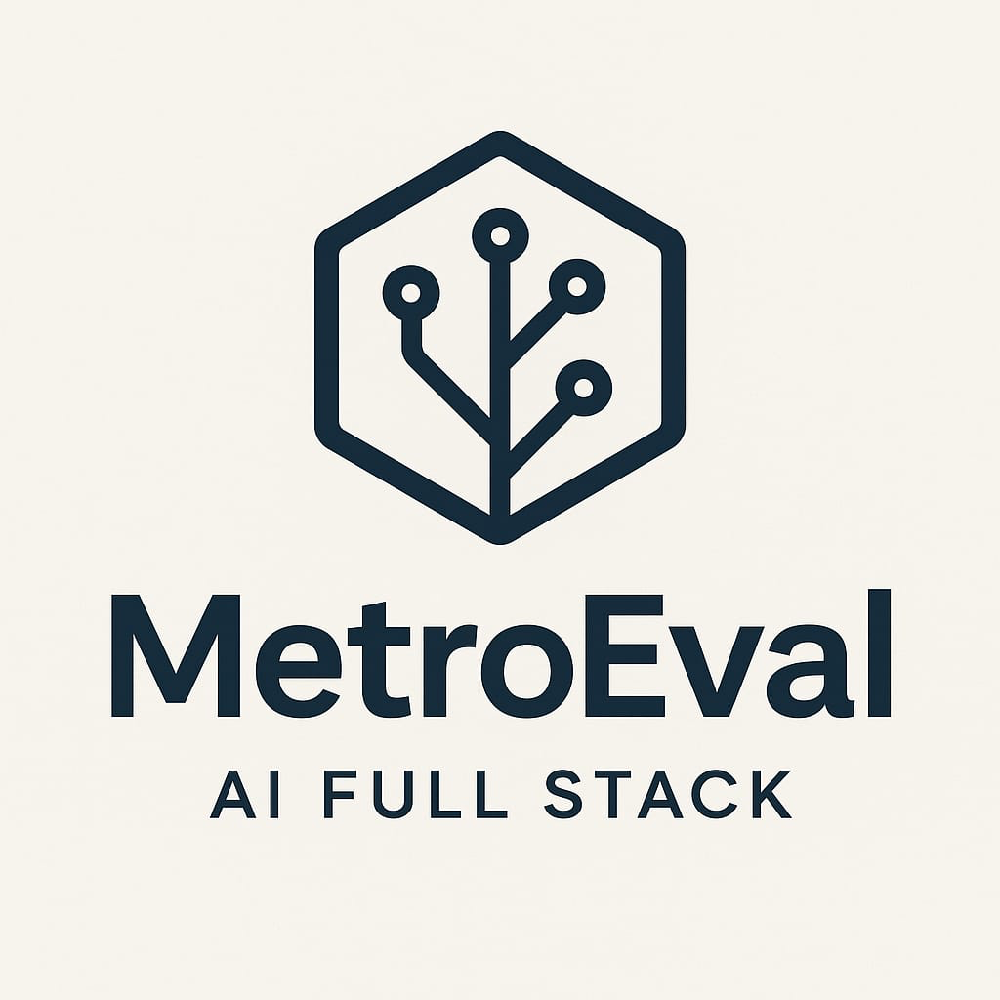
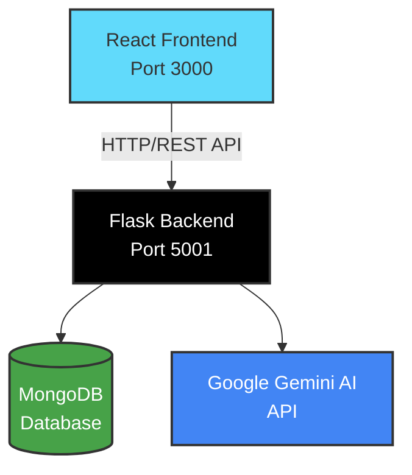

<div align="center">

# 🎓 MetroEval

### **AI-Powered Feedback & Peer Review System**

**Built for Metropolia University of Applied Sciences**

[](https://www.python.org/)
[](https://reactjs.org/)
[](https://flask.palletsprojects.com/)
[](https://www.mongodb.com/)
[](https://gemini.google.com/)

[Features](#-features) • [Quick Start](#-quick-start) • [Documentation](#-documentation) • [API Reference](#-api-documentation)

---



</div>

## 📖 About

**MetroEval** is a production-grade, full-stack educational platform that revolutionizes the feedback and peer review process. Leveraging **Google Gemini AI**, it provides instant, comprehensive feedback on student submissions while facilitating intelligent peer matching and performance analytics.

### ✨ What Makes MetroEval Special?

<div align="center">

| 🚀 **Instant AI Feedback** | 👥 **Smart Peer Matching** | 📊 **Advanced Analytics** |
|:---:|:---:|:---:|
| Get detailed feedback in seconds | Intelligent algorithm-based pairing | Track progress with insights |
| Multi-dimensional analysis | Department & skill-based matching | Identify at-risk students |

</div>

---

## 🎯 Key Features

### 🎓 For Students

<table>
<tr>
<td width="50%">

#### 📝 **Submission Management**
- ✅ Multi-file upload support
- ✅ Version history tracking
- ✅ Practice mode submissions
- ✅ Code, essays, and reports

</td>
<td width="50%">

#### 🤖 **AI-Powered Feedback**
- ⚡ Instant feedback generation
- 📊 Multi-dimensional scoring
- 🎯 Detailed improvement suggestions
- 📋 Submission-type-specific templates

</td>
</tr>
<tr>
<td width="50%">

#### 👥 **Peer Reviews**
- 🔄 Receive & provide feedback
- 📋 Structured feedback forms
- 💬 Feedback reactions & discussions
- ⚖️ Fair workload distribution

</td>
<td width="50%">

#### 📚 **Learning Tools**
- 🃏 AI-generated flashcards
- 💬 Interactive tutor chat
- 📖 Learning resources
- 📄 Submission templates

</td>
</tr>
</table>

### 👨‍🏫 For Teachers

<table>
<tr>
<td width="50%">

#### 📊 **Dashboard & Analytics**
- 📈 Student performance overview
- ⚠️ At-risk student identification
- 🎯 Department-wide analytics
- 🔮 Performance prediction models

</td>
<td width="50%">

#### 📋 **Management Tools**
- 👥 Student management
- 📝 Submission review & grading
- 🔍 Peer review oversight
- 📢 Announcements & deadlines

</td>
</tr>
</table>

---

## 🏗️ Architecture

### Tech Stack

<div align="center">

#### **Backend** 🐍

| Component | Technology | Version |
|:---------:|:----------:|:-------:|
| **Framework** | Flask | 3.0.0 |
| **Database** | MongoDB (MongoEngine) | 0.27.0 |
| **AI Service** | Google Gemini | 2.0 Flash |
| **ML/Analytics** | scikit-learn, numpy, pandas | Latest |
| **Security** | Flask-Login, Flask-Limiter | Latest |
| **Testing** | pytest, pytest-cov | Latest |

#### **Frontend** ⚛️

| Component | Technology | Version |
|:---------:|:----------:|:-------:|
| **Framework** | React | 18.2.0 |
| **Build Tool** | Vite | 5.0.8 |
| **Routing** | React Router DOM | 6.20.0 |
| **HTTP Client** | Axios | 1.6.2 |
| **Charts** | Chart.js | 4.4.0 |
| **Testing** | Vitest, RTL | Latest |

</div>

### System Architecture



**Text Representation:**

```
┌─────────────────────────────────┐
│   React Frontend (Port 3000)   │
│   ⚛️ Vite + React + Router      │
└──────────────┬──────────────────┘
               │ HTTP/REST API
               │ (withCredentials)
┌──────────────▼──────────────────┐
│   Flask Backend (Port 5001)     │
│   🐍 Python + Flask + MongoEngine│
└──────┬──────────────────┬───────┘
       │                  │
┌──────▼──────┐  ┌────────▼────────┐
│   MongoDB   │  │  Gemini AI API │
│   🍃 NoSQL  │  │  🤖 AI Service  │
└─────────────┘  └─────────────────┘
```

---

## 🚀 Quick Start

### Prerequisites

Make sure you have the following installed:

- 🐍 **Python** 3.8+ (3.10+ recommended)
- 📦 **Node.js** 16+ (18+ recommended)
- 🍃 **MongoDB** 4.4+ (local or remote)
- 🔑 **Google Gemini API Key** ([Get one here](https://makersuite.google.com/app/apikey))

### Installation

#### 1️⃣ Clone the Repository

```bash
git clone <repository-url>
cd MetroEval
```

#### 2️⃣ Backend Setup

<details open>
<summary><b>🐍 Detailed Python Environment Setup</b></summary>

##### Step 1: Verify Python Installation

```bash
# Check Python version (3.8+ required, 3.10+ recommended)
python3 --version
```

**Expected Output:**
```
Python 3.9.6
```

> ⚠️ **macOS Note**: Use `python3` and `pip3` commands, not `python` or `pip`

---

##### Step 2: Navigate to Backend Directory

```bash
cd backend
```

---

##### Step 3: Create Virtual Environment

```bash
# Create isolated Python environment
python3 -m venv venv
```

**What This Does:**
- ✅ Creates a `venv/` directory with isolated Python installation
- ✅ Prevents system-wide package conflicts
- ✅ Ensures reproducible dependencies across team members

---

##### Step 4: Activate Virtual Environment

**macOS/Linux:**
```bash
source venv/bin/activate
```

**Windows (PowerShell):**
```powershell
venv\Scripts\Activate.ps1
```

**Windows (CMD):**
```cmd
venv\Scripts\activate.bat
```

**Verification:**
- Your terminal prompt should now show `(venv)` prefix:
```bash
(venv) user@machine backend %
```

---

##### Step 5: Upgrade pip (Recommended)

```bash
# Upgrade to latest pip version
pip install --upgrade pip
```

---

##### Step 6: Install Project Dependencies

```bash
# Install all required packages from requirements.txt
pip install -r requirements.txt
```

**Installed Packages Include:**
- 🌐 **Flask 3.0.0** - Web framework
- 🍃 **MongoEngine 0.27.0** - MongoDB ODM
- 🔐 **Flask-Login 0.6.3** - Authentication
- 🤖 **Google Generative AI** - Gemini API
- 📊 **scikit-learn, numpy, pandas** - ML/Analytics
- 🧪 **pytest** - Testing framework
- ⚡ **gunicorn** - Production WSGI server

**Expected Output:**
```
Successfully installed Flask-3.0.0 mongoengine-0.27.0 ...
```

---

##### Step 7: Verify Installation

```bash
# Check installed packages
pip list
```

**You should see 23+ packages installed.**

---

##### Step 8: Configure Environment Variables

Copy the example environment file and fill in your values:

```bash
# Copy .env.example to .env
cp .env.example .env
```

Then edit `backend/.env` and update the following required values:

```env
# Security - Generate a secure random key
SECRET_KEY=your-super-secret-key-change-in-production
# Generate one with: python -c "import secrets; print(secrets.token_hex(32))"

# Database - MongoDB connection
MONGODB_URI=mongodb://localhost:27017/afprs
# Or use individual settings:
# MONGODB_HOST=localhost
# MONGODB_PORT=27017
# MONGODB_DB=afprs

# AI Configuration - Required for AI features
GEMINI_API_KEY=your-gemini-api-key-here
# Get your API key from: https://ai.google.dev/

# Optional: Specify Gemini model (default: gemini-2.0-flash)
# GEMINI_MODEL=gemini-2.0-flash

# Server Configuration
FLASK_ENV=development
# PORT=5001  # Optional, defaults to 5001

# CORS - Add your frontend URL
CORS_ALLOWED_ORIGINS=http://localhost:5173,http://localhost:3000
```

> 📋 **Note**: The `.env.example` file contains all available configuration options with detailed comments. Copy it to `.env` and customize as needed.

> 🔑 **Get Gemini API Key**: [https://ai.google.dev/](https://ai.google.dev/)

---

##### ✅ Setup Complete!

Your backend environment is now ready. Run the development server:

```bash
# Make sure venv is activated (you should see (venv) in prompt)
PYTHONPATH=. python3 app/main.py
```

**Backend will be available at:** `http://localhost:5001`

</details>

---

<details>
<summary><b>📋 Daily Workflow: Working with Virtual Environment</b></summary>

**Every time you start working on the backend:**

```bash
# 1. Navigate to backend directory
cd backend

# 2. Activate virtual environment
source venv/bin/activate  # macOS/Linux
# venv\Scripts\activate     # Windows

# 3. Verify activation (should show (venv) prefix)
# (venv) user@machine backend %

# 4. Run the application
PYTHONPATH=. python3 app/main.py
```

**When you're done working:**

```bash
# Deactivate virtual environment
deactivate
```

</details>

---

<details>
<summary><b>🔧 Troubleshooting Backend Setup</b></summary>

##### ❌ Problem: `command not found: python3`

**Solution:**
```bash
# Check if Python is installed
which python3
python --version

# Install Python if not present
# macOS: brew install python3
# Ubuntu: sudo apt install python3 python3-pip
# Windows: Download from python.org
```

---

##### ❌ Problem: `command not found: pip`

**Solution:**
```bash
# On macOS/Linux, use pip3 instead
pip3 install -r requirements.txt

# Or ensure pip is installed
python3 -m ensurepip --upgrade
```

---

##### ❌ Problem: `ModuleNotFoundError` when running

**Solution:**
```bash
# Ensure virtual environment is activated
source venv/bin/activate

# Reinstall dependencies
pip install -r requirements.txt

# Use PYTHONPATH when running
PYTHONPATH=. python3 app/main.py
```

---

##### ❌ Problem: MongoDB connection errors

**Solution:**
1. Verify MongoDB is running:
   ```bash
   # Check if MongoDB is running
   ps aux | grep mongod
   
   # Start MongoDB
   # macOS: brew services start mongodb-community
   # Linux: sudo systemctl start mongodb
   ```

2. Check `.env` file has correct `MONGODB_URI`:
   ```bash
   # Ensure .env file exists (copy from .env.example if needed)
   cp backend/.env.example backend/.env
   # Then edit backend/.env with your MongoDB settings
   ```

3. Test connection:
   ```bash
   # Install mongosh if needed
   mongosh mongodb://localhost:27017/afprs
   ```

---

##### ❌ Problem: Port 5001 already in use

**Solution:**
```bash
# Find process using port 5001
lsof -i :5001

# Kill the process
kill -9 <PID>

# Or change port in .env file
PORT=5002
```

</details>

#### 3️⃣ Frontend Setup

```bash
cd frontend
npm install
```

#### 4️⃣ Environment Configuration

**Backend Environment Variables** (`backend/.env`):

1. **Copy the example file:**
   ```bash
   cd backend
   cp .env.example .env
   ```

2. **Edit `.env` and configure required values:**
   ```env
   # Required: Security key (generate a secure random key)
   SECRET_KEY=your-secret-key-here-generate-a-secure-random-key
   
   # Required: MongoDB connection
   MONGODB_URI=mongodb://localhost:27017/afprs
   
   # Required: Gemini API key for AI features
   GEMINI_API_KEY=your-gemini-api-key-here
   
   # Required: Flask environment
   FLASK_ENV=development
   
   # Required: CORS allowed origins (comma-separated)
   CORS_ALLOWED_ORIGINS=http://localhost:5173,http://localhost:3000
   
   # Optional: Gemini model (default: gemini-2.0-flash)
   # GEMINI_MODEL=gemini-2.0-flash
   
   # Optional: Server port (default: 5001)
   # PORT=5001
   ```

   > 📋 **Full Configuration**: See `backend/.env.example` for all available options with detailed documentation.

**Frontend Environment Variables** (`frontend/.env`) - *Optional*:

```env
VITE_API_URL=http://localhost:5001/api
```

> ⚠️ **Important**: Never commit `.env` files to version control. The `.env.example` file is safe to commit as it contains no sensitive data.

### 🏃 Running the Application

#### Development Mode

**Terminal 1 - Backend:**
```bash
cd backend
source venv/bin/activate
PYTHONPATH=. python3 app/main.py
```
🌐 Backend: `http://localhost:5001`

**Terminal 2 - Frontend:**
```bash
cd frontend
npm run dev
```
🌐 Frontend: `http://localhost:3000`

#### Production Deployment

**Backend:**
```bash
cd backend
gunicorn -w 4 -b 0.0.0.0:5001 app.wsgi:app
```

**Frontend:**
```bash
cd frontend
npm run build
# Serve dist/ with nginx, Apache, or your preferred server
```

---

## 🧪 Testing

### Backend Tests

```bash
cd backend
pytest
# With coverage report
pytest --cov=app --cov-report=html
```

### Frontend Tests

```bash
cd frontend
npm test
# Interactive UI
npm run test:ui
# Coverage report
npm run test:coverage
```

### Run All Tests

```bash
./scripts/run-tests.sh
```

---

## 📁 Project Structure

```
MetroEval/
│
├── 📂 backend/
│   ├── 📂 app/
│   │   ├── __init__.py          # Application factory
│   │   ├── main.py              # Entry point
│   │   ├── config.py            # Configuration
│   │   ├── wsgi.py              # Production WSGI
│   │   │
│   │   ├── 📂 api/
│   │   │   ├── 📂 v1/           # API v1 endpoints
│   │   │   │   ├── auth.py
│   │   │   │   ├── submissions.py
│   │   │   │   ├── feedback.py
│   │   │   │   ├── peer_reviews.py
│   │   │   │   ├── flashcards.py
│   │   │   │   ├── tutor.py
│   │   │   │   └── teacher.py
│   │   │   └── static.py
│   │   │
│   │   ├── 📂 core/
│   │   │   └── database.py      # MongoDB setup
│   │   │
│   │   ├── 📂 models/           # MongoEngine models
│   │   │   ├── user.py
│   │   │   ├── submission.py
│   │   │   ├── feedback.py
│   │   │   └── ...
│   │   │
│   │   ├── 📂 services/         # Business logic
│   │   │   ├── ai_service.py
│   │   │   ├── peer_matching_service.py
│   │   │   └── performance_predictor_service.py
│   │   │
│   │   ├── 📂 middleware/       # Flask middleware
│   │   │   ├── auth_middleware.py
│   │   │   ├── cors_middleware.py
│   │   │   ├── error_handler.py
│   │   │   └── security_middleware.py
│   │   │
│   │   ├── 📂 utils/            # Utilities
│   │   └── 📂 exceptions/      # Custom exceptions
│   │
│   ├── .env.example             # Environment variables template
│   ├── requirements.txt
│   └── pytest.ini
│
├── 📂 frontend/
│   ├── 📂 src/
│   │   ├── App.jsx              # Main component
│   │   ├── main.jsx             # React entry
│   │   │
│   │   ├── 📂 components/       # Shared components
│   │   ├── 📂 features/         # Feature modules
│   │   │   ├── auth/
│   │   │   ├── dashboard/
│   │   │   ├── submissions/
│   │   │   ├── learning/
│   │   │   └── profile/
│   │   │
│   │   ├── 📂 context/          # React Context
│   │   ├── 📂 services/         # API services
│   │   ├── 📂 hooks/            # Custom hooks
│   │   └── 📂 styles/           # CSS files
│   │
│   ├── package.json
│   └── vite.config.js
│
├── 📂 tests/
│   ├── 📂 backend/
│   └── 📂 frontend/
│
└── 📂 scripts/
    └── run-tests.sh
```

---

## 🔌 API Documentation

### Base URLs

| Environment | URL |
|:-----------:|:---:|
| **Development** | `http://localhost:5001/api/v1` |
| **Production** | `https://your-domain.com/api/v1` |

### Authentication

All protected endpoints require authentication via **Flask-Login session cookies**. The frontend automatically handles this with `withCredentials: true`.

### Key Endpoints

<details>
<summary><b>🔐 Authentication Endpoints</b></summary>

| Method | Endpoint | Description |
|:------:|:--------:|:-----------|
| `POST` | `/api/v1/auth/register` | Register new user |
| `POST` | `/api/v1/auth/login` | User login |
| `POST` | `/api/v1/auth/logout` | User logout |
| `GET` | `/api/v1/auth/me` | Get current user |

</details>

<details>
<summary><b>📝 Submission Endpoints</b></summary>

| Method | Endpoint | Description |
|:------:|:--------:|:-----------|
| `POST` | `/api/v1/submit` | Submit assignment |
| `GET` | `/api/v1/submissions` | List submissions |
| `GET` | `/api/v1/submissions/<id>` | Get submission details |
| `PUT` | `/api/v1/submissions/<id>` | Update submission |

</details>

<details>
<summary><b>💬 Feedback Endpoints</b></summary>

| Method | Endpoint | Description |
|:------:|:--------:|:-----------|
| `GET` | `/api/v1/feedback/<submission_id>` | Get feedback |
| `POST` | `/api/v1/feedback` | Create feedback |
| `PUT` | `/api/v1/feedback/<id>` | Update feedback |

</details>

<details>
<summary><b>👥 Peer Review Endpoints</b></summary>

| Method | Endpoint | Description |
|:------:|:--------:|:-----------|
| `GET` | `/api/v1/peer-reviews` | List peer reviews |
| `POST` | `/api/v1/peer-reviews` | Create peer review |
| `PUT` | `/api/v1/peer-reviews/<id>` | Complete review |

</details>

<details>
<summary><b>📚 Learning Tools Endpoints</b></summary>

| Method | Endpoint | Description |
|:------:|:--------:|:-----------|
| `POST` | `/api/v1/flashcards/generate` | Generate flashcards |
| `POST` | `/api/v1/tutor/chat` | Chat with AI tutor |

</details>

<details>
<summary><b>👨‍🏫 Teacher Endpoints</b></summary>

| Method | Endpoint | Description |
|:------:|:--------:|:-----------|
| `GET` | `/api/v1/teacher/students` | List all students |
| `GET` | `/api/v1/teacher/analytics` | Get analytics |
| `GET` | `/api/v1/teacher/predictions` | Performance predictions |

</details>

### Response Format

**Success Response:**
```json
{
  "success": true,
  "data": {
    // Response data
  },
  "message": "Optional success message"
}
```

**Error Response:**
```json
{
  "success": false,
  "error": "Error message",
  "code": "ERROR_CODE"
}
```

---

## 🔐 Security Features

<div align="center">

| 🔒 **Authentication** | 🛡️ **API Security** | 🔐 **Data Protection** | ✅ **Academic Integrity** |
|:---------------------:|:-------------------:|:---------------------:|:------------------------:|
| Flask-Login sessions | Rate limiting | Secure cookies | Plagiarism detection |
| Role-based access | CORS protection | File upload limits | Semantic analysis |
| Password hashing | Security headers | Input sanitization | Version tracking |

</div>

---

## 🎓 Department Support

MetroEval supports **6 departments** across Metropolia:

<div align="center">

| 🎓 General Studies | ⚙️ Engineering & CS | 💼 Business & Economics |
|:-----------------:|:------------------:|:---------------------:|
| 🎨 Design & Creative Arts | 🏥 Health & Life Sciences | 📚 Social Sciences & Humanities |

</div>

Each department features:
- ✅ Custom courses
- ✅ Department-specific analytics
- ✅ Filtered peer review matching
- ✅ Resource organization

---

## 🤖 AI Integration

### Google Gemini AI

MetroEval leverages **Google Gemini 2.0 Flash** for:

<div align="center">

| 🎯 **Feedback Generation** | 🃏 **Flashcard Creation** | 💬 **Tutor Chat** |
|:-------------------------:|:----------------------:|:----------------:|
| Multi-dimensional analysis | Topic-based generation | Interactive Q&A |
| Code & essay templates | Adaptive difficulty | Context-aware responses |
| Detailed suggestions | Coding & conceptual | Code explanations |

</div>

### Configuration

Configure Gemini AI in your backend `.env` file:

```env
# Required: Gemini API key
GEMINI_API_KEY=your-gemini-api-key-here

# Optional: Model selection (default: gemini-2.0-flash)
# Available models: gemini-2.0-flash, gemini-1.5-flash, gemini-1.5-pro
# Note: gemini-2.0-flash has stricter quota limits on free tier
GEMINI_MODEL=gemini-2.0-flash
```

**Model Selection:**
- **`gemini-2.0-flash`** (default): Latest model, best performance, stricter quotas
- **`gemini-1.5-flash`**: Free tier friendly, good quotas, fast responses
- **`gemini-1.5-pro`**: Higher quality, lower quotas

The system automatically falls back to `gemini-1.5-flash` if quota limits are hit with the configured model. If the API key is not configured, the system gracefully degrades and provides fallback functionality.

---

## 📊 Performance & Scalability

### Backend Optimizations

- 🗄️ **Database Indexing**: MongoDB indexes on frequently queried fields
- ⚡ **Query Optimization**: Efficient MongoEngine queries with limits
- 💾 **Caching**: Session-based caching for user data
- 🔗 **Connection Pooling**: MongoDB connection management

### Frontend Optimizations

- 📦 **Code Splitting**: Vite automatic code splitting
- 🚀 **Lazy Loading**: Route-based lazy loading
- 🎨 **Asset Optimization**: Vite build optimizations
- 🔄 **API Caching**: Axios response caching

### Scalability

- ↔️ **Horizontal Scaling**: Stateless backend design
- 🗄️ **Database Sharding**: MongoDB sharding support
- 🌐 **CDN Integration**: Static asset delivery
- ⚖️ **Load Balancing**: Gunicorn multi-worker support

---

## 🐛 Troubleshooting

<details>
<summary><b>❌ MongoDB Connection Failed</b></summary>

**Solutions:**
- Verify MongoDB is running: `mongod --version`
- Check `MONGODB_URI` in `.env`
- Ensure MongoDB is accessible on configured host/port
- Check firewall settings

</details>

<details>
<summary><b>🤖 Gemini API Errors</b></summary>

**Solutions:**
- Verify `GEMINI_API_KEY` is set correctly in `backend/.env`
- Check API quota limits (free tier has daily/minute limits)
- If hitting quota limits, the system automatically falls back to `gemini-1.5-flash`
- You can also manually set `GEMINI_MODEL=gemini-1.5-flash` in `.env` for better quotas
- Review error logs in backend console for specific error messages
- Ensure API key has proper permissions at [Google AI Studio](https://ai.google.dev/)
- Get a new API key: [https://ai.google.dev/](https://ai.google.dev/)

**Common Errors:**
- **429 Quota Exceeded**: Switch to `gemini-1.5-flash` or wait for quota reset
- **400 API Key Invalid**: Verify your API key is correct
- **403 Permission Denied**: Check API key permissions in Google Cloud Console

</details>

<details>
<summary><b>🌐 CORS Issues</b></summary>

**Solutions:**
- Ensure frontend URL is in CORS allowed origins
- Check `withCredentials` is set in Axios config
- Verify backend CORS middleware configuration

</details>

<details>
<summary><b>🍪 Session Not Persisting</b></summary>

**Solutions:**
- Verify cookies are enabled in browser
- Check `SECRET_KEY` is set consistently
- Ensure same-site cookie settings
- Check browser privacy settings

</details>

---

## 📝 Development Guidelines

### Code Style

- **Python**: Follow PEP 8, use type hints where appropriate
- **JavaScript**: Follow ESLint configuration, use modern ES6+
- **React**: Functional components with hooks, feature-based organization

### Git Workflow

1. 🌿 Create feature branch from `main`
2. ✏️ Make changes with descriptive commits
3. ✅ Run tests before committing
4. 🔄 Submit pull request with description

### Testing Requirements

- ✅ New features must include tests
- 📊 Maintain >80% code coverage
- 🧪 Test both success and error paths

---

## ⚙️ Configuration

### Backend Configuration

Key settings in `backend/app/config.py`:

| Setting | Default | Description |
|:-------:|:-------:|:-----------|
| **Departments** | 6 | Predefined departments |
| **File Upload** | 5MB | Max file size |
| **Peer Review** | 2 | Peers per submission (1-5) |
| **Page Size** | 20 | Default API pagination (max 100) |
| **Flashcards** | 25 | Default count (max 100) |
| **Quiz Time** | 20 min | Default quiz duration |

### Security Settings

- 🔒 **Session Security**: HTTP-only cookies, SameSite=Lax, 24-hour lifetime
- ⏱️ **Rate Limiting**: Configured via Flask-Limiter
- 🌐 **CORS**: Configured for frontend origin
- 🛡️ **Security Headers**: Flask-Talisman protection

---

## 🚀 Future Implementation

This section outlines planned enhancements and improvements based on architectural review and best practices. These features will further enhance the platform's scalability, reliability, and user experience.

### 🗄️ Database Management & Scalability

**Current State:**
- Large data operations lack pagination limits
- Some queries fetch unlimited results (e.g., `User.objects(role='student').limit(500)`)

**Planned Improvements:**
- ✅ **Implement comprehensive pagination** across all list endpoints
- ✅ **Add database query optimization** with proper indexing strategies
- ✅ **Implement cursor-based pagination** for large datasets
- ✅ **Add query result caching** for frequently accessed data
- ✅ **Database connection pooling** optimization
- ✅ **Implement read replicas** for read-heavy operations
- ✅ **Add database sharding** support for horizontal scaling

**Implementation Priority:** High

---

### 📝 Error Handling & Logging

**Current State:**
- Inconsistent error logging (mix of `print()` and `logger`)
- No centralized logging configuration
- Some exception handling too broad (`except Exception`)

**Planned Improvements:**

#### Structured Logging System
```python
# Centralized logging configuration with rotation
import logging
from logging.handlers import RotatingFileHandler

def setup_logging(app):
    if not app.debug:
        file_handler = RotatingFileHandler(
            'logs/metroeval.log', 
            maxBytes=10240000, 
            backupCount=10
        )
        file_handler.setFormatter(logging.Formatter(
            '%(asctime)s %(levelname)s: %(message)s [in %(pathname)s:%(lineno)d]'
        ))
        file_handler.setLevel(logging.INFO)
        app.logger.addHandler(file_handler)
        app.logger.setLevel(logging.INFO)
```

- ✅ **Centralized logging configuration** with structured format
- ✅ **Log rotation** to prevent disk space issues
- ✅ **Specific exception handling** (replace `except Exception` with specific types)
- ✅ **Request/response logging** middleware for API debugging
- ✅ **Error tracking integration** (e.g., Sentry, Rollbar)
- ✅ **Performance logging** for slow queries and API calls
- ✅ **Structured JSON logging** for production environments

**Implementation Priority:** High

---

### ⚙️ Environment Configuration

**Current State:**
- No `.env.example` files provided
- Secret key defaults to development value
- Missing production deployment configuration

**Planned Improvements:**

#### Environment Template Files
```bash
# backend/.env.example
SECRET_KEY=generate-with-python-secrets-token-urlsafe-32
MONGODB_URI=mongodb://localhost:27017/db
GEMINI_API_KEY=your-api-key-here
FLASK_ENV=production
LOG_LEVEL=INFO
REDIS_URL=redis://localhost:6379/0
```

- ✅ **Create `.env.example` files** for both backend and frontend
- ✅ **Environment validation** on application startup
- ✅ **Configuration schema validation** using Pydantic
- ✅ **Production deployment guides** with environment-specific configs
- ✅ **Secret management** integration (AWS Secrets Manager, HashiCorp Vault)
- ✅ **Configuration documentation** with all available options

**Implementation Priority:** Medium

---

### 👥 Enhanced Peer Matching Algorithm

**Current State:**
- Basic matching algorithm (simple first-available selection)
- No skill level consideration
- No workload distribution fairness

**Planned Improvements:**

#### Intelligent Matching Algorithm
```python
def match_peers(self, submission_id, submitter_id, course_id, department):
    submitter = User.objects(id=submitter_id).first()
    
    # Get students with similar skill levels (±0.2 range)
    candidates = User.objects(
        role='student',
        id__ne=submitter_id,
        department=department,
        skill_level__gte=submitter.skill_level - 0.2,
        skill_level__lte=submitter.skill_level + 0.2
    )
    
    # Count existing reviews per student (fairness)
    review_counts = {}
    for candidate in candidates:
        count = PeerReview.objects(reviewer_id=candidate.id).count()
        review_counts[str(candidate.id)] = count
    
    # Sort by review count and randomize within groups
    sorted_candidates = sorted(candidates, key=lambda s: review_counts.get(str(s.id), 0))
    
    return [str(s.id) for s in sorted_candidates[:self.peers_per_submission]]
```

- ✅ **Skill level matching** (pair similar or complementary levels)
- ✅ **Workload fairness algorithm** (distribute reviews evenly)
- ✅ **Review quality tracking** (match high-performing reviewers)
- ✅ **Avoid repeated pairings** (track pairing history)
- ✅ **Course/topic expertise** consideration
- ✅ **Machine learning-based matching** (learn from successful pairings)
- ✅ **Configurable matching strategies** (similar vs. complementary skills)

**Implementation Priority:** High

---

### 🔌 API Design Improvements

**Current State:**
- Inconsistent response formats
- No API versioning in all routes
- Missing pagination metadata
- No request validation schema

**Planned Improvements:**

#### Standardized Response Format
```python
# Standardized pagination response
def paginated_response(data, page, per_page, total):
    return success_response({
        'items': data,
        'pagination': {
            'page': page,
            'per_page': per_page,
            'total': total,
            'pages': (total + per_page - 1) // per_page,
            'has_next': page * per_page < total,
            'has_prev': page > 1
        }
    })
```

#### Request Validation Schema
```python
from marshmallow import Schema, fields, validate

class SubmissionSchema(Schema):
    assignment_title = fields.Str(
        required=True, 
        validate=validate.Length(min=3, max=200)
    )
    content = fields.Str(
        required=True, 
        validate=validate.Length(min=10)
    )
    submission_type = fields.Str(
        required=True, 
        validate=validate.OneOf(['code', 'essay', 'report'])
    )
```

- ✅ **Consistent response format** across all endpoints
- ✅ **Complete API versioning** (`/api/v1/` for all routes)
- ✅ **Pagination metadata** (total count, page info, has_next/has_prev)
- ✅ **Request validation** using Marshmallow or Pydantic
- ✅ **API documentation** with OpenAPI/Swagger specification
- ✅ **API rate limiting** per endpoint and user
- ✅ **Response caching** headers (ETag, Last-Modified)
- ✅ **API versioning strategy** for backward compatibility

**Implementation Priority:** High

---

### ⚛️ Frontend State Management

**Current State:**
- Using Context API for everything (causes unnecessary re-renders)
- No caching for API responses
- No optimistic updates
- Repeated API calls on component remounts

**Planned Improvements:**

#### Server State Management
- ✅ **React Query (TanStack Query)** integration for server state
- ✅ **Automatic caching** and background refetching
- ✅ **Optimistic updates** for better UX
- ✅ **Request deduplication** to prevent duplicate calls
- ✅ **Stale-while-revalidate** pattern
- ✅ **Pagination support** with infinite scroll
- ✅ **Error retry logic** with exponential backoff
- ✅ **Cache invalidation** strategies

**Implementation Priority:** Medium

---

### ⚡ Performance Optimization

**Current State:**
- Loading entire submission lists without lazy loading
- Large AI responses not streamed
- No caching layer (Redis not implemented)

**Planned Improvements:**

#### Backend Optimizations
- ✅ **Redis caching layer** for frequently accessed data
- ✅ **AI response streaming** for large responses
- ✅ **Database query result caching**
- ✅ **CDN integration** for static assets
- ✅ **Response compression** (gzip/brotli)
- ✅ **Database connection pooling** optimization
- ✅ **Background job processing** (Celery/RQ)

#### Frontend Optimizations
- ✅ **Virtual scrolling** for large lists
- ✅ **Lazy loading** for images and components
- ✅ **Code splitting** optimization
- ✅ **Service worker** for offline support
- ✅ **Image optimization** and lazy loading
- ✅ **Bundle size optimization**

**Implementation Priority:** High

---

### 📊 Monitoring & Observability

**Current State:**
- Basic health check endpoint exists
- No comprehensive monitoring

**Planned Improvements:**

#### Health Check Enhancements
- ✅ **Enhanced health check** endpoint with detailed status
- ✅ **Database connection health** monitoring
- ✅ **External service health** (Gemini API, MongoDB)
- ✅ **Dependency health checks** (Redis, file storage)

#### Observability Stack
- ✅ **Application Performance Monitoring (APM)** integration
- ✅ **Slow query logging** and analysis
- ✅ **API response time tracking**
- ✅ **AI API usage and cost tracking**
- ✅ **Error rate monitoring** and alerting
- ✅ **User activity metrics** and analytics
- ✅ **System resource monitoring** (CPU, memory, disk)
- ✅ **Distributed tracing** for request flows

**Implementation Priority:** Medium

---

### 🎛️ Feature Flags

**Current State:**
- Features enabled/disabled via code changes

**Planned Improvements:**

#### Feature Flag System
- ✅ **Feature flag infrastructure** (LaunchDarkly, Unleash, or custom)
- ✅ **Runtime feature toggling** without code deployment
- ✅ **A/B testing support** for new features
- ✅ **Gradual rollouts** (percentage-based)
- ✅ **Environment-specific flags** (dev, staging, production)
- ✅ **User-specific feature flags** for beta testing

**Implementation Priority:** Low

---

### ♿ Accessibility Improvements

**Current State:**
- Basic accessibility considerations

**Planned Improvements:**

#### WCAG 2.1 Compliance
- ✅ **Keyboard navigation** support throughout the application
- ✅ **Screen reader compatibility** testing and fixes
- ✅ **High contrast mode** support
- ✅ **ARIA labels** and semantic HTML
- ✅ **Focus management** for modals and dynamic content
- ✅ **Color contrast** compliance (WCAG AA/AAA)
- ✅ **Accessibility testing** automation (axe-core, Pa11y)
- ✅ **Skip navigation links** for keyboard users

**Implementation Priority:** Medium

---

### 📈 Analytics Dashboard

**Current State:**
- Basic analytics in teacher dashboard

**Planned Improvements:**

#### Enhanced Analytics
- ✅ **System usage metrics** dashboard
- ✅ **Student engagement metrics** (login frequency, submission rates)
- ✅ **AI feature usage** analytics
- ✅ **Peer review effectiveness** metrics
- ✅ **Performance trends** over time
- ✅ **Department comparison** analytics
- ✅ **Export capabilities** (CSV, PDF reports)
- ✅ **Custom date range** filtering
- ✅ **Real-time metrics** dashboard

**Implementation Priority:** Low

---

### 🔐 Enhanced Security Features

**Planned Improvements:**
- ✅ **Two-factor authentication (2FA)** support
- ✅ **OAuth integration** (Google, Microsoft)
- ✅ **Session management** improvements (concurrent session limits)
- ✅ **IP whitelisting** for admin endpoints
- ✅ **Audit logging** for sensitive operations
- ✅ **Security headers** enhancement (HSTS, CSP improvements)
- ✅ **DDoS protection** integration
- ✅ **Regular security audits** and penetration testing

**Implementation Priority:** Medium

---

### 🤖 AI Feature Enhancements

**Planned Improvements:**
- ✅ **Enhanced plagiarism detection** with semantic analysis
- ✅ **Multi-language support** for feedback generation
- ✅ **Custom AI model fine-tuning** for domain-specific feedback
- ✅ **Batch processing** for multiple submissions
- ✅ **AI feedback quality scoring** and improvement suggestions
- ✅ **Conversational AI** improvements with context memory
- ✅ **Voice input support** for tutor chat

**Implementation Priority:** Low

---

### 📱 Mobile Support

**Planned Improvements:**
- ✅ **Progressive Web App (PWA)** implementation
- ✅ **Mobile-responsive design** improvements
- ✅ **Touch gesture** support
- ✅ **Offline functionality** with service workers
- ✅ **Mobile app** (React Native or Flutter)

**Implementation Priority:** Low

---

## 📄 License

[Specify your license here]

---

## 👥 Contributors

[Add contributors here]

---

## 🙏 Acknowledgments

<div align="center">

| 🎓 Metropolia University | 🤖 Google Gemini AI | 🐍 Flask & React Communities |
|:----------------------:|:------------------:|:---------------------------:|
| For the vision | For AI capabilities | For amazing frameworks |

</div>

---

## 📞 Support

<div align="center">

**Need help?** We're here for you!

- 🐛 [Open an issue](https://github.com/your-repo/issues) on GitHub
- 📧 Contact the development team
- 📚 Review the documentation

</div>

---

<div align="center">

### **Built with ❤️ for Metropolia University of Applied Sciences**

**Made with** ⚛️ React • 🐍 Flask • 🤖 Gemini AI • 🍃 MongoDB

[⬆ Back to Top](#-metroeval)

</div>
